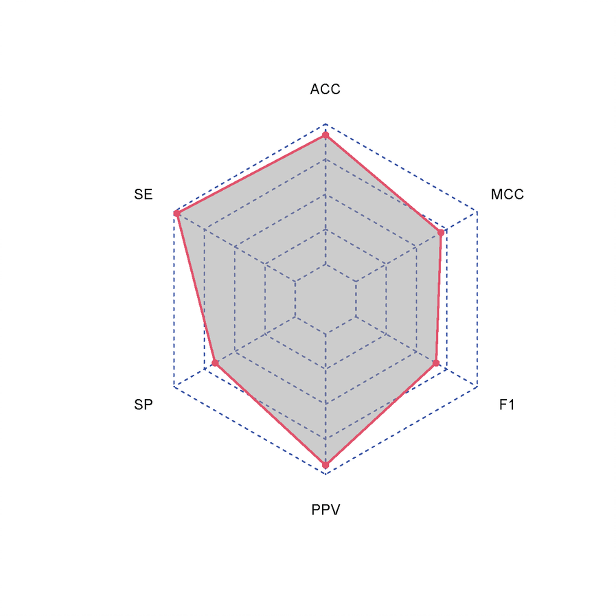
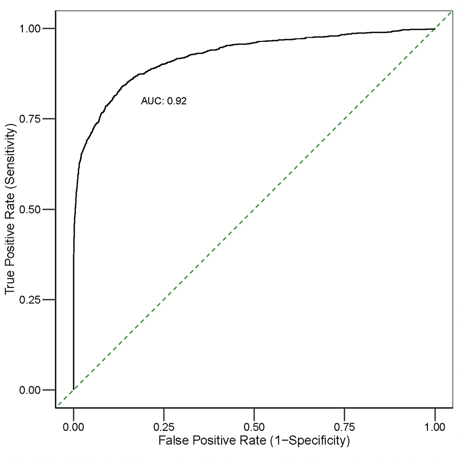
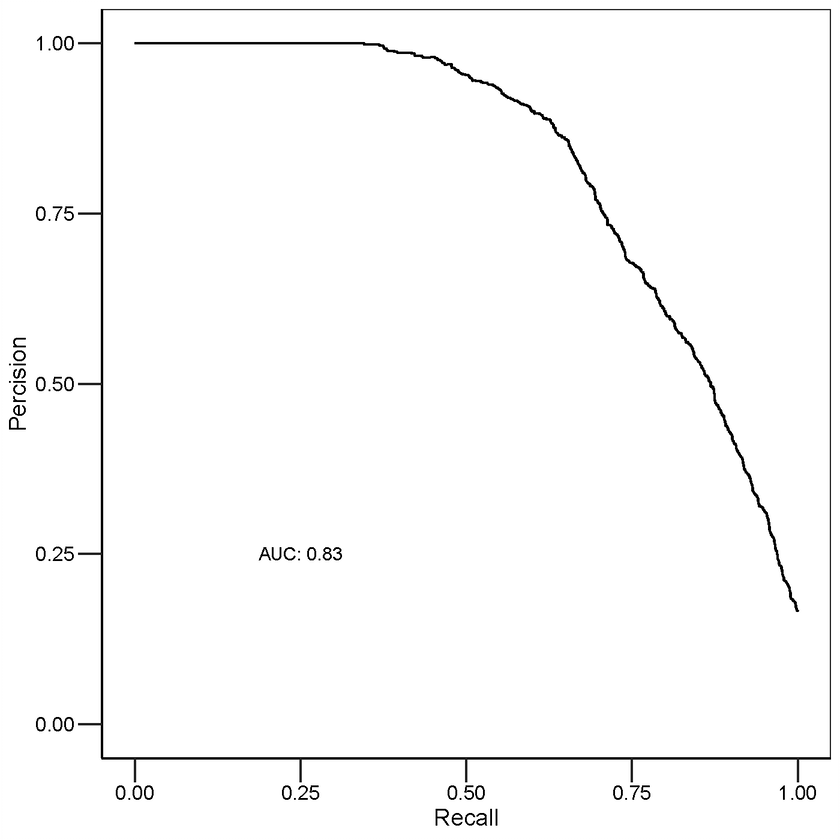

```{r setup, include = FALSE}
knitr::opts_chunk$set(echo = TRUE)
```


# Introduction
Most cellular tasks involve proteins; however, proteins primarily function as 
macromolecular assemblies, playing pivotal roles in regulating almost all 
cellular processes. Therefore, systematic mapping of multi-protein complexes 
formed by protein-protein interactions (PPI) is key to understanding the 
mechanistic basis of cellular processes. Several proteomic methods
have been developed to map protein macromolecular assemblies, such
as yeast two-hybrid (Y2H) screens or affinity purification coupled 
with mass spectrometry (AP-MS). However, such approaches are challenging to 
scale up or apply to non-model organisms. Biochemical co-fractionation coupled 
to mass spectrometry (CF-MS) is a more flexible strategy to characterize native 
macromolecules on a global scale [@havugimana2012census]. However, a key 
challenge in the fractionation-based approach is the lack of sensitivity and 
resolution of fractionation that require more advanced computational analysis 
to identify true positive interactions, which can be hard to implement. 

For this purpose, we developed a novel tool named deepCE to predict 
interactomes
from CF/MS data via harnessing the power of deep learning (DL) and subsequently 
identifying protein complexes via a sophisticated clustering procedure. Briefly, 
for each fractionation experiment, search output resulting 
from database searching is summarized into a matrix, where rows 
correspond to proteins and absolute or 
relative quantification of proteins (spectral count or summed MS1 ion 
intensity) for a corresponding fraction are represented as columns. Instead of 
computing pair-wise correlation using protein elution profiles as performed 
previously [@hu2019epic;@skinnider2021prince], 
co-elution data are directly concatenated to form a master matrix for input 
into the learner. For classification purposes, the literature-curated 
co-complex PPIs derived from a public database 
(e.g., CORUM, [@ruepp2010corum]) are then mapped onto an experimental 
master matrix, which in turn will be used as an input set for the built-in 
deep-learning algorithm to score potential proteins pairs via cross-validation 
strategy. To enhance the performance of the deep-learning algorithm, 
a parameter sweep strategy is implemented to identify the choice of parameters 
that improve the model performance. The probabilistic interaction network is 
finally partitioned to predict protein complexes via a 
sophisticated clustering procedure that optimizes clustering parameters 
relative to literature-curated protein complexes. 


# deepCE computational workflow: step-by-step analysis

Co-elution data analysis using deepCE comprises i) data pre-processing,
ii) data preparation for prediction purposes, iii) interactome prediction
via deep learning models, and iv) complex reconstruction from putative 
interactome via unsupervised algorithm, called ClusterONE. 
In the following, we will explain the main steps of the deepCE workflow 
in detail, emphasizing the arguments adjustable by the user.

## Input data requirements
The data files accepted by deepCE are simple tables containing relative 
quantification of proteins across collected fractions. The rows correspond to 
identified proteins, each labelled with a unique name, and columns correspond 
to fractions. To demonstrate the use of deepCE, we will use a demo co-elution 
data, derived from a subset of the data presented in [@havugimana2012census]. 
In this paper, the authors applied the CF/MS approach to map human protein 
complexes in cytoplasmic extracts, which were resolved 
by different biochemical techniques. An example of CF/MS input data, 
bundled with the deepCE package, can be loaded  with the following command:

```{r warning = FALSE, message=FALSE}
# Loading packages required for data handling & visualization
library(ggplot2)
library(tidyr)
library(dplyr)
library(igraph)
library(fgsea)

# Loading deepCE package
library(deepCE)
# Loading the demo data
data(HelaCE)
dim(HelaCE)
```

## Pre-processing
Prior interactome scoring, deepCE applies different data-processing steps, 
including missing value imputation, data-noise reduction, 
row-wise normalization, and post-processing figures. 

- `impute_MissingData` provides the option to impute zero-values that occur 
at random (MAR) by applying spline fit across the fractionation table. 
We recommend that a zero value is 
considered as ‘missing at random’ in case a quantitative (non-zero) signal 
has been detected in both the two fractions preceding and following 
the fraction in question, controlled by 
arguments `bound_left` and `bound_right`.The effect of imputation on 
raw data can also be visualized by setting the argument `plotImputationSummary`
to TRUE. 

```{r}
dat_p1 <- impute_MissingData(HelaCE,bound_left = 2,bound_right = 2)
```

- `RemoveSinglePeak` provides the option to remove the data noise by 
replacing single-fraction peaks with zero. Users can also see the effect
of this pre-processing on the raw data by setting the `plot_RemovalSinglePeaks` 
to TRUE.

```{r}
dat_p2 <-
  RemoveSinglePeak(dat_p1)
```

- `filter_ConsecutivePep` allows removal of false-positive peptides that have 
never been detected in more than *N* consecutive fractions, controlled by 
argument `min_stretch_length`.
```{r}
dat_p3 <-
  filter_ConsecutivePep(dat_p2,min_stretch_length=2)
```

- `scaling_m` standardize every protein co-elution profile by performing 
row-wise normalization.
```{r}
dat_p4 <-
  scaling_m(dat_p3)
```


## Data input construction for prediction 
To score potential interactions in the processed metric, the deepCE packages 
take two inputs: a co-elution data matrix and a literature-curated set of 
protein complexes.  Co-elution profiles of a given protein in a co-elution 
data matrix are then directly concatenated by `getPPI` function. 
For instance, if protein A has the vector reading *m* 
(protein elution profile) and protein B has the vector reading *n*, 
the co-elution profiles of two proteins are
concatenated as m+n to represent their interaction profiles. To  reduce
noises in the interaction profile, one can also exclude PPIs below 0.5
correlation score by setting the `similarity_calculation` argument to TRUE.

```{r message = FALSE, warning = FALSE}
conc_dat <- getPPI(dat_p4)
```

To construct class labels for training purposes, the literature curated 
complexes can be downloaded from the CORUM database via the deepCE package 
using `getCPX` function, or users can submit their list of reference 
complexes. The `refcpx`, bundled with the deepCE package, is extracted from 
CORUM database. Positive and negative PPIs can then be generated from protein 
complexes by `build_trainingData`. A positive PPI is defined as 
protein pairs that belong to the same complex. The negative PPIs are protein 
pairs in the annotated reference set but never participate within the same 
protein complex.

```{r}
# Load reference set 
data("refcpx")
t_data <- build_trainingData(dat_p4, refcpx)
```


## Interactome scoring via deep learning
The deepCE deploys two DL models: the multi-layer perceptron (MLP) and 
one-dimensional convolutional neural networks (1D-CNN) of the Python deep 
learning package [Keras](https://github.com/rstudio/keras) in an R interface to 
predict PPIs. The deep learning frameworks provided in the deepCE package take 
constructed master matrix and class labels as input objects and score every 
potential protein-protein interaction via a *k*-fold 
cross-validation strategy. The deepCE package also enables estimation of the 
algorithmic performance of the trained model via cross-validation and the use 
of different performance measures such as Recall (Sensitivity), 
Specificity, Accuracy, Precision, F1-score, and Matthews correlation 
coefficient (MCC). 

### MLP architecture
MLP model in the  `MLP_m` function comprises of at least 
three layers including input, hidden and 
output layers. Each of these layers contains several neurons (i.e., nodes) that 
includes edges, or weights, connecting to each successive layers in the 
network. The intermediate hidden layers will use ReLU as their activation 
function and it is a function meant to zero-out negative. Additionally, 
dropout layers (for the purpose of helping a network avoid overfitting) 
and batch normalization (for the purpose of helping with gradient propagation) 
are used between each of the hidden layers. Values from the last hidden layer 
will be received by the output layer that uses a sigmoid activation function 
to output a probability vector (a score between 0 and 1, indicating how likely 
the sample is to have the target "1": that is, 
how likely the PPI is to be positive). MLP uses backpropogation via appropriate 
optimizer for training the network. 


This function takes the following parameters:

- `data` A matrix containing concatenated co-elution profiles,
generated from `getPPI` function.
- `train_d` A matrix of training data containing numerical features,
generated from `build_trainingData` function.
- `train_l` A vector of binary categorical label (0-1),
generated from `build_trainingData` function.
- `nlayers` Number of hidden layers. Defaults to 2.
- `powerto1` Integer, the number of neurons in the first hidden layer as defined 
by two to the power of this value. Defaults to 6.
- `powerto2` Integer, the number of neurons in the subsequent hidden layer as 
defined by two to the power of this value. Defaults to 7.
- `drate` Numeric, the dropout rate. Defaults to 0.1.
- `optimizer` Name of the optimizer. Defaults to "rmsprop".
- `b_size` Number of samples per gradient update. Defaults to 128.
- `epochs` Number of epochs to train the model. Defaults to 50.
- `cv_fold` Number of partitions for cross-validation; defaults to 5.
- `plots` Logical value, indicating whether to plot the performance of the 
learning algorithm using k-fold cross-validation, defaults to FALSE.


To predict interactions via MLP, the following command can be executed:

```{r message = FALSE, warning = FALSE}
# set the seed to ensure reproducible output
set.seed(100)
MLP_interactions <- 
  MLP_m(conc_dat, #concatenated co-elution profiles
      t_data$train_d, #training data matrix
      t_data$train_l, #training data label
      cv_fold = 5) 
head(MLP_interactions)
```
Finally, users can subset their list of high-confidence interactions for further 
analysis, using a classifier confidence ensemble score cutoff of 
at least 0.5. 

### 1D-CNN architecture
The 1D-CNN model in `oneD_CNN` function includes at least three layers: 
convolutional, pooling, 
and a fully connected (FC) layer. 
The convolutional operations are defined by filters, a kernel size, stride, 
and padding, followed by applying an activation function (i.e., ReLU) to 
generate a feature map. The information generated by the feature maps is 
then passed on to the pooling layers, which are responsible for processing 
the input by reducing the size of the input, speeding up the computation time 
and training process, and consequently, making a more robust feature detection.
The generated features are then passed onto the FC layer to combine inputs 
with the synaptic weights of the 
connections of the previous layer. The summed total of these inputs becomes 
an input to the ReLU function. The values from the last layer will then be 
received by the output layer that uses a sigmoid activation function to 
output a probability vector. 1D-CNN uses backpropogation via appropriate 
optimizer for training the network. 

This function takes the following arguments:

- `data` A matrix containing concatenated co-elution profiles,
generated from `getPPI` function.
- `train_d` A matrix of training data containing numerical features,
generated from `build_trainingData` function.
- `train_l` A vector of binary categorical label (0-1),
generated from `build_trainingData` function.
- `nlayers` Number of hidden layers; defaults to 3.
- `filters_1` Integer, the dimensionality of the output space 
(i.e. the number of output filters in the first convolution).Defaults to 64.
- `filters_2` Integer, the dimensionality of the output space 
(i.e. the number of output filters in the subsequent convolution). 
Defaults to 128.
- `kernel_size` An integer or tuple/list of 2 integers, specifying the height 
and width of the 2D convolution window. Can be a single integer to specify 
the same value for all spatial dimensions. Defaults to 3.
- `strides` An integer or tuple/list of 2 integers, specifying the strides 
of the convolution along the height and width. Can be a single integer to 
specify the same value for all spatial dimensions. Defaults to 1.
- `pool_size` Down samples the input representation by taking the maximum 
value over a spatial window of size pool_size. Defaults to 2.
- `powerto` Integer, the number of neurons in the last layer defined by two to 
the power of this value. Defaults to 4.
- `drate` Numeric, the dropout rates. Defaults to 0.1.
- `optimizer` Name of optimizer; Defaults to "rmsprop".
- `b_size` Number of samples per gradient update. Defaults to 64.
- `epochs` Number of epochs to train the model. Defaults to 50.
- `cv_fold` Number of partitions for cross-validation; defaults to 5.
- `plots` Logical value, indicating whether to plot the performance of the 
learning algorithm using k-fold cross-validation; defaults to FALSE.


To prediction interactions via 1d-CNN, the following command can be executed:

```{r message = FALSE, warning = FALSE, eval = FALSE}
# set the seed to ensure reproducible output
set.seed(101)
oneDCNN_interactions <- 
  oneD_CNN(conc_dat, #concatenated co-elution profiles
      t_data$train_d, #training data matrix
      t_data$train_l, #training data label
      cv_fold = 5) 
```

**Note that for both DL models, to avoid overfitting, the loss on the 
validation set is monitored by early stopping.**


### Model tunning 

The default values for both MLP and 1D-CNN architecture have been already 
optimized by applying both models to several heterogeneous co-elution data and 
ensures high-performance. But, in case of low-performance on your co-elution 
data, we recommend testing different configurations for hyperparameters, 
like the number of layer, nodes, drop rates etc., for training to achieve the 
best performing model. For MLP model, this can be 
achieved by using `MLP_tunning` function, that takes training data as input 
and considers optimizing the number of layers `nlayers`, 
neurons per layer `powerto1 or powerto2`, the type of optimizer `optimizer`, 
dropout rate `drate`,and batch-size `b_size`. For 1D-CNN model, this can be 
achieved by using `oneDCNN_tunning` and considers optimizing the number of 
layers `nlayers`, neurons per layer `filters_2 or filters_3`, 
kernel size `kernel_size`, strides `strides`, pool size `pool_size`, 
the number of neurons in the last layer (i.e., MLP layer) `powerto`, the type 
of optimizer `optimizer`, dropout rate `drate`,and batch-size `b_size`. 
Following tuning, both functions automatically generate reports to observe 
comparisons between runs.


For example , To run parameter optimization for MLP model,
we can run the following commands:

```{r results="hide", warning = FALSE, fig.show="hide"}
set.seed(102)
tuning_result <-
    MLP_tunning(t_data$train_d, 
                t_data$train_l,
                nlayers = 2,
                powerto1 = c(4,6,7),
                powerto2 = c(4,6,7), 
                b_size = 128, 
                metrics = "accuracy",
                epochs = 50, k = 0.3)
```

From the above tale, we can identify the minimum validation error for each 
run:

```{r}
f<- 
  tuning_result %>%
  filter(metric == "loss") 

min_val_error <- 
  f %>%
  filter(data == "validation") %>%
  group_by(run) %>% summarise(min_value.error = 
                                round(min(value, na.rm = TRUE), 3))
head(min_val_error)
```
we can also visualize the results per run to see set of parameters that 
achieved the global minimal loss:

```{r results="hide", warning = FALSE}
ggplot(f, aes(epoch, value, color = data)) +
  geom_point(size = 0.1) +
  geom_line() +
  theme_bw() +
  facet_wrap(.~ run)+
  geom_label(data = min_val_error, aes(label=min_value.error), 
             x = Inf, y = -Inf, hjust=1, vjust=0,
             inherit.aes = FALSE)

```

From the above figure, we can select the run # that has achieved the 
minimum validation error and result in slight increase in performance. 
Therefore, we can use those sets of parameters to 
construct our final model for interactome prediction. 

## Network-based prediction of protein complexes
High confidence predicted network (from section `2.4`) can be partitioned via 
the 
[ClusterONE](https://paccanarolab.org/static_content/clusterone/cl1-procope-1.0.html) 
clustering algorithm to 
identify protein complex membership. The input data for this function must be 
in `ppi_input_ClusterOne.txt` format. Therefore, we previously saved the 
predicted high-confidence 
network from section `2.4.1` in our system directory. Finally, we can run 
the `get_clusters` function to predict putative complexes using the 
high-confidence network as input data. 

The `get_clusters` takes the following arguments: 

- `csize`  Numerical value, the minimum size of the predicted complexes.
Defaults to 3.
- `d` A number, specifies the density of predicted complexes. Defaults to 0.3.
- `p` An integer, specifies the penalty value for the inclusion of each node.
Defaults to 2.
- `mx_overlap` A number, specifies the maximum allowed
overlap between two clusters. Defaults to 0.8.
- `tpath` A character string indicating the path to the project
directory that contains the interaction data. Interactions data must be
stored as `ppi_input_ClusterOne.txt` file and 
containing id1-id2-weight triplets.


The following command can be used to predict putative complexes:
```{r}
pred_cpx <- get_clusters(csize = 3, 
                         d = 0.3, p = 2,mx_overlap = 0.8,
                         tpath =file.path(system.file("extdata", 
                                                      package = "deepCE")))
```

### ClusterONE Hyparparameter Optimization
As with many unsupervised machine learning methods, ClusterONE algorithms 
include tunable parameters for optimizing its performance. We, therefore,
create a function called `Clust_tuning` that applies grid strategy to 
choose the best combination of parameters that best recapitulated known 
complexes. For each parameter combination setting, the overlap of resulting 
predicted complexes are compared against an independent benchmark of known 
complexes (i.e., CORUM complexes) via three evaluation matrices 
(i.e., maximum matching ratio *(MMR)*, accuracy *(Acc)*, and overlap *(O)*) 
and those parameters yield the highest final composite score 
(sum of *O*, *Acc*, and *MMR*) can then be used to predict complexes. To 
avoid evaluation biases, we recommend to first reduce redundancy in the known 
reference complexes via `RemoveCpxRedundance` function. This function 
reduces redundancy in the reference complexes by first computing the overlap 
of two complexes via Jaccard index, followed by merging overlapping complexes
with user-defined threshold. 


To perform cluster optimization, we can use the following command: 

```{r}
data("refcpx")
set.seed(103)
Clust_tuning_result <-
  Clust_tuning(refcpx, csize = 3, 
                d = c(0.3,0.4),
                p = c(2, 2.5),
                mx_overlap = c(0.6,0.7),
                tpath =
                  file.path(system.file("extdata", package = "deepCE")))
```

we can then visualize the results per run to see set of parameters that 
achieved the highest composite score:

```{r} 
ggplot(Clust_tuning_result, aes(tune_names, compScore)) +
  geom_point(size = 3) +
  coord_flip() +
  theme_bw() +
  theme(text = element_text(size=15)) +
  theme(axis.line = element_line(colour = "black"),
        panel.grid.major = element_blank(),
        panel.grid.minor = element_blank()) +
  theme(axis.text = element_text(
    color = "black", # label color and size
    size = 12))  +
  theme(axis.ticks = element_line(
    colour = "black",
    size = 0.75, linetype = "solid"
  )) +
  theme(axis.ticks.length=unit(0.3, "cm"))

```

# deepCE computational workflow: one-step analysis
The main function of the deepCE package are `prePPI_MLP` and `predPPI_1D.CNN`.
Both functions provides and end-to-end workflow for predicting interactomes 
from CF/MS data via deep learning approach and subsequently identifying protein 
complexes via unsupervised approach. Briefly, these functions begins by 
executing several pre-processing steps (section `2.2`) to improve 
prediction quality. The processed co-elution profiles of putative interacting 
proteins are concatenated and, with a set of reference complexes (section
`2.3`),are fed into a multi-layer perceptron (MLP) or one-dimensional 
convolutional neural network (1D-CNN) (section `2.4`). 
These models then generate a 
weighted protein interaction network via cross-validation strategy,
in which edge weights between protein nodes represent the deep learning model’s 
probability estimate for interactions. Interactions below the user-defined 
threshold are excluded from further analysis. Finally,  high-confidence 
networks is partitioned to predict protein complexes via ClusterONE 
clustering method (section `2.5`). Following prediction, three `.txt` 
files including the predicted interactome, high-confidence network, 
and predicted complexes are returned in the user-defined directory. In case 
of low-performance of the prediction algorithms, we recommend users to first
use the tuning functions (`MLP_tunning`, `oneDCNN_tunning`)
and substitute the default values with the values resulting
in the highest performance.  


## Prediction via Multilayer Perceptron (MLP)

The `prePPI_MLP` function takes the following arguments:


- `data` A data matrix with rows including proteins and fractions
along the columns, or a `MSnSet` object.
- `refcpx` A list of known reference complexes.
- `data_imputed` If true, detects and imputes missing values. Defaults
to FALSE.
- `remove_SinglePeak` If TRUE, removes Single Peak. Defaults to FALSE.
- `remove_ConsecutivePep` If TRUE, filters peptides by consecutive
peptide detection. Defaults to TRUE.
- `min_stretch_length` Numeric integer, the minimal length a stretch of
continuous identifications has to have in order not to be removed.
Defaults to 3.
- `similarity_calculation` If TRUE, this function first computes the
similarity of protein pairs based on co-elution pattern via one of the
user-defined `metric`. It then removes protein pairs below 0.5
similarity score.Defaults to TRUE.
- `metric` The measure of association including:
c(pearson", "spearman", "kendall", "bicor", "cosine", "jaccard",
"euclidean", "manhattan", "weighted_rank", "mutual_information",
"zero_count_bayesian", "weighted_cross_correlation", or
"pearson_plusNoise"); Defaults to pearson.
- `nlayers` Number of hidden layers. Defaults to 2.
- `powerto1` Integer, the number of neurons in the first hidden layer
as defined by two to the power of this value. Defaults to 6.
- `powerto2` Integer, the number of neurons in the subsequent hidden
layer as defined by two to the power of this value. Defaults to 7.
- `drate` Numeric, the dropout rates. Defaults to 0.1.
- `optimizer` Name of the optimizer.For most models, this defaults 
to "rmsprop"
- `b_size` Number of samples per gradient update. Defaults to 128.
- `epochs` Number of epochs to train the model. Defaults to 50. 
- `cv_fold` Number of partitions for cross-validation; Defaults to 5.
- `cutoff` An integer range between [0,1] for specifying the cutoff for 
classifier confidence score to subset the high-confidence interactions.
- `plots` Logical value, indicating whether to plot the performance of
the learning algorithm using k-fold cross-validation; Defaults to FALSE.
- `csize`  Numerical value, specifying the minimum size of the 
predicted complexes.
Defaults to 3.
- `d` A number, specifying the density of predicted complexes; defaults to 0.3.
- `p` An integer, specifying the penalty value for the inclusion of each node;
defaults to 2.
- `mx_overlap` A number, specifying  the maximum allowed
overlap between two clusters; defaults to 0.8.
- `tpath`  character string indicating the path to the project directory.

Once we have loaded a co-elution matrix and list of gold standard protein 
complexes into R, inferring the interactome and protein complexes with
`prePPI_MLP` using default parameters is therefore as simple as the 
following command:

```{r results="hide", message = FALSE, warning = FALSE}
data("HelaCE")
data("refcpx")
MLP_prediction_outputs <- 
  predPPI_MLP(HelaCE,
              refcpx,
              cv_fold = 5,
              tpath = tempdir())
```

When the `plots` argument set to TRUE, the `prePPI_MLP` function generates 
one pdf file indicating the performance of the model using k-fold cross-
validation. 

- The first plot shows the accuracy (ACC), F1-score ,positive predictive value 
(PPV),sensitivity (SE),and Matthews correlation coefficient (MCC)
of the model via radar plot.

  <p align="right"> **Figure 1: Radar plot.**


- The second plot shows the Receiver Operating Characteristic (ROC) curve.

  <p align="right"> **Figure 2: ROC_Curve curve.**
  
- The third plot shows the Precision-Recall (PR) curve 

  <p align="right"> **Figure 3: Precision-Recall (PR) curve.**

## Prediction via one-dimensional convolution neural network (1D-CNN)
  
The `predPPI_1D.CNN` function takes the following arguments:

- `data` A data matrix with rows including proteins and fractions
along the columns, `MSnSet` object.
-`refcpx` A list of known reference complexes.
-`data_imputed` If true, detects and imputes missing values. Defaults
to FALSE.
- `remove_SinglePeak` If TRUE, removes Single Peak. Defaults to FALSE.
- `remove_ConsecutivePep` If TRUE, filters peptides by consecutive
peptide detection. Defaults to TRUE.
- `min_stretch_length` Numeric integer, the minimal length a stretch of
continuous identifications has to have in order not to be removed.
Defaults to 3. 
- `scaling` If TRUE, performs row-wise normalization. Defaults to TRUE.
- `similarity_calculation` If TRUE, this function first computes the
similarity of protein pairs based on co-elution pattern via one of the
user-defined `metric`. It then removes protein pairs below 0.5
similarity score.Defaults to TRUE.
- `metric` The measure of association including:
c(pearson", "spearman", "kendall", "bicor", "cosine", "jaccard",
"euclidean", "manhattan", "weighted_rank", "mutual_information",
"zero_count_bayesian", "weighted_cross_correlation", or
"pearson_plusNoise"); Defaults to pearson.
- `nlayers` Number of hidden layers. Defaults to 2.
- `filters_1` Integer, the dimensionality of the output space
(i.e. the number of output filters in the first convolution).
Defaults to 64.
- `filters_2` Integer, the dimensionality of the output space
(i.e. the number of output filters in the subsequent convolution).
Defaults to 128.
- `kernel_size` An integer or tuple/list of 2 integers, specifying the
height and width of the 2D convolution window. Can be a single integer to
specify the same value for all spatial dimensions.
Defaults to 3.
- `strides` An integer or tuple/list of 2 integers, specifying the
strides of the convolution along the height and width. Can be a single
integer to specify the same value for all spatial dimensions.
Defaults to 1.
- `pool_size` Downsamples the input representation by taking the
maximum value over a spatial window of size pool_size.
Defaults to 2.
- `powerto` Integer, the number of neurons in the last layer
as defined by two to the power of this value.
Defaults to 4. 
- `drate` Numeric, the dropout rates.
Defaults to 0.1.
- `b_size` Number of samples per gradient update.Defaults to 128.
- `epochs` Number of epochs to train the model.Defaults to 50. 
- `cv_fold` Number of partitions for cross-validation; Defaults to 5.
- `cutoff` An integer range between [0,1] for specifying the cutoff for 
classifier confidence score to subset the high-confidence interactions.
Defaults to 0.5.
- `plots` Logical value, indicating whether to plot the performance of
the learning algorithm using k-fold cross-validation; Defaults to FALSE.
- `csize`  Numerical value, specifying the minimum size of the 
predicted complexes.
Defaults to 3.
- `d` A number, specifying the density of predicted complexes; defaults to 0.3.
- `p` An integer, specifying the penalty value for the inclusion of each node;
defaults to 2.
- `mx_overlap` A number, specifying  the maximum allowed
overlap between two clusters; defaults to 0.8.
- `tpath`  character string indicating the path to the project directory.

Prediction of interactomes and putative complexes via `predPPI_1D.CNN` using
default parameters is therefore as simple as the following command:

```{r  message = FALSE, warning = FALSE, eval=FALSE}
data("HelaCE")
data("refcpx")
oneDCNN_prediction_outputs <- 
  predPPI_1D.CNN(HelaCE,
              refcpx,
              cv_fold = 5)
```


# Additional features

## Network visualization 
The predicted networks can also be visualized in 
[Cytoskape](http://www.cytoscape.org/download.php) tool 
directly from R by using the 
[RCy3](https://bioconductor.org/packages/RCy3/) R package. 

For example to visualize the high-confidence network from section `3.1`, 
make sure to first launch Cytoscape and the run the following commands: 

```{r, eval=FALSE}
ig <- 
   graph_from_data_frame(MLP_prediction_outputs$ppi_input_ClusterOne)

createNetworkFromIgraph(ig,"myIgraph")
```

## GO and pathway enrichment analysis of protein complexes 
To enable enrichment analysis for three GO domains (molecular function, 
cellular component and biological process), KEGG and REACTOME pathways, 
g:profiler [@kolberg2020gprofiler2] is applied with an FDR 
p‐value correction per each complex via the `enrichfindCPX` function. 

For instance, the following command can be used to performs GO.BP functional 
enrichment analysis of predicted complexes from section `3.1`:

```{r, warning=FALSE, message=FALSE, results='hide', eval = FALSE}
# extract the predicted complexes
predcpx <- MLP_prediction_outputs$predicted_cpx

enrich_result <- 
  enrichfindCPX(predcpx,
                threshold = 0.05,
                sources = "GO:BP",
                p.corrction.method = "bonferroni",
                org = "hsapiens")
```

## Calculation of differential protein-protein interactions
To identify altered interactions, deepCE implements the `comp.2.cc.fdr2`
function in the 
[DiffCorr](https://cran.rstudio.com/web/packages/DiffCorr/index.html)
package, where it first computes Pearson correlation
(PCC) to calculate protein elution profile similarity, followed by computing 
the differences between the two correlations via 
Fisher's z-test. Identified DIPs can then be mapped to 
complexes/Go annotation/pathways provided by the users via 
gene set enrichment analysis (GSEA), using the 
[fgsea](https://bioconductor.org/packages/fgsea/) R package to
determine the biological meaning of DIPs. 

Identification of differential interacting proteins (DIPs) between 
two experimental conditions can be computed using the following command:
```{r,message=FALSE, results='hide', warning=FALSE, fig.show="hide"}
# profile 1
data("m1")
# profile 2
data("m2")
# biological term (here is known complexes)
data("refcpx")
diff_output <- diffPPI(m1, 
                       m2, 
                       refcpx,
                       minSize = 2,
                       maxSize = 10000,
                       tpath = tempdir())
```

One can also make an enrichment plot for a pathway:

```{r}
plotEnrichment(diff_output$term_list[["F1F0-ATP synthase, mitochondrial"]],
               diff_output$vec_rank) +
  labs(title="F1F0-ATP synthase, mitochondrial") +
   theme_bw() +
  theme(text = element_text(size=15)) +
  theme_bw() +
  theme(axis.line = element_line(colour = "black"),
        panel.grid.major = element_blank(),
        panel.grid.minor = element_blank()) +
  theme(axis.text = element_text(
    color = "black", # label color and size
    size = 12))  +
  theme(axis.ticks = element_line(
    colour = "black",
    size = 0.75, linetype = "solid"
  )) +
  theme(axis.ticks.length=unit(0.3, "cm"))

```


## Correlation methods 
The deepCE package also included up to 13 measures of associations to 
quantify the similarity of each chromatogram pairs in an unsupervised way. 
These measures of associations included in the package are 
Pearson correlation, Spearman correlation, Kendall rank correlation, 
biweight midcorrelation, Cosine similarity, Jaccard index, Euclidean distance, 
Manhattan distance, Weighted rank correlation, Mutual information, 
Bayesian correlation, Weighted cross-correlation, and 
Pearson correlation plus noise. One can also combine the similarity scores with 
classifier prediction output to reduce noises in the predicted PPI network. 
For instance, following prediction, [@havugimana2012census] only kept 
protein pairs with a correlation score of at least 0.5 to reduce the total 
number of predicted interactions. 

To compute similarity between two proteins we can run the 
following command: 
```{r}
scored_Data <- similarity_score(HelaCE, metric = "pearson")
```

# Session info

```{r}
sessionInfo()
```

# References
